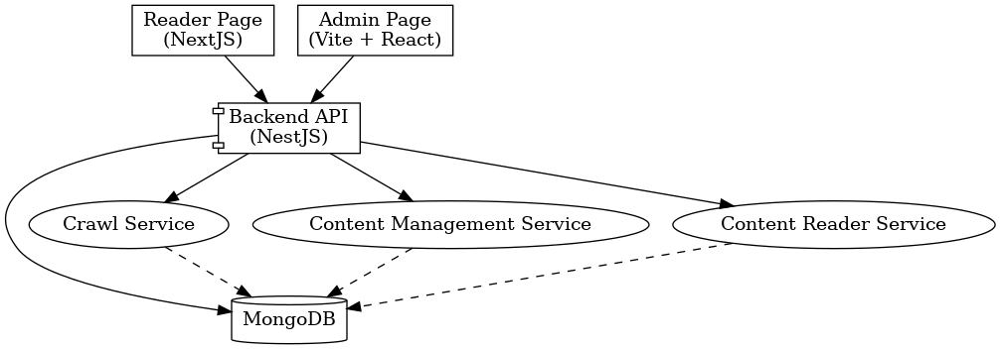

# 📚 Web Truyện – Hệ Thống Đọc Truyện Fullstack

## 🔥 Kiến trúc tổng thể



---

## 🧱 Công nghệ sử dụng

| Layer        | Tech Stack                              |
|--------------|------------------------------------------|
| Backend      | NestJS + MongoDB + Mongoose              |
| Reader FE    | NextJS (App Router)                      |
| Admin FE     | React + Vite + TailwindCSS               |
| Auth         | JWT + Google OAuth2                      |
| Crawler      | Cheerio (TTV, Vtruyen)                   |
| DevOps       | Docker, Docker Compose                   |

---

## 📁 Cấu trúc thư mục chính

```
.
├── backend/                 # NestJS Backend API
│   ├── modules/            # Auth, User, Role, Crawler, Content
│   ├── schemas/            # Mongoose Schemas
│   ├── seeder/             # Seed & Check Roles + Users
│   ├── common/             # Middleware, Guards
│   └── main.ts, app.module.ts
│
├── reader-frontend/         # NextJS trang đọc truyện
├── admin-frontend/          # Vite React trang quản trị
├── .env                     # Biến môi trường toàn hệ thống
├── docker-compose.yml       # Khởi chạy toàn bộ hệ thống
└── webtruyen-architecture-updated.png # Sơ đồ hệ thống
```

---

## 🧪 Các chức năng chính

- ✅ Đăng ký, đăng nhập, Google OAuth
- ✅ Refresh token, logout, forgot/reset password
- ✅ Quản lý truyện, chương, tác giả, thể loại, tag
- ✅ Bình luận, đề cử, lượt thích
- ✅ Phân quyền: `reader`, `admin`, `superadmin`
- ✅ Swagger API docs
- ✅ Rate Limit toàn hệ thống
- ✅ Crawler tangthuvien / vtruyen
- ✅ Seeder: role + user mặc định
- ✅ Kiểm tra seed chính xác (`check.ts`)

---

## 🚀 Khởi chạy hệ thống

### 1. Tạo `.env` trong `backend/`

```env
MONGO_URI=mongodb://mongo:27017/truyen
JWT_SECRET=secret123
JWT_REFRESH_SECRET=refresh123
JWT_PASSWORD_SECRET=pwreset123

SEED_SUPERADMIN_PASSWORD=123456super
SEED_ADMIN_PASSWORD=123456admin
SEED_READER_PASSWORD=123456reader

PORT=5000
```

### 2. Build & Run bằng Docker Compose

```bash
docker compose up --build
```

- 🔗 Swagger: [http://localhost:5000/docs](http://localhost:5000/docs)
- 🔗 Reader FE: [http://localhost:3000](http://localhost:3000)
- 🔗 Admin FE: [http://localhost:3001](http://localhost:3001)

---

## 🧬 Seeder

```bash
cd backend
npm run seed
```

Tạo 3 tài khoản mặc định:
- `superadmin@development.com`
- `admin@development.com`
- `reader@development.com`

---

Seed on docker
```bash
  docker exec -it webtruyen-backend npm run seed
```


## ✅ Kiểm tra dữ liệu seed

```bash
npm run check
```

- Kiểm tra mỗi role và user tồn tại đúng **1 bản ghi**
- In kết quả rõ ràng ra terminal

---

Check on docker
```bash
docker exec -it webtruyen-mongo mongosh
```

## 📎 Phân quyền

| Role        | Quyền hạn                         |
|-------------|-----------------------------------|
| superadmin  | Quản lý user, banned, phân quyền |
| admin       | Thêm truyện, chapter              |
| reader      | Đọc truyện, bình luận             |
